# Relatório — Metodologia Completa

**Projeto HID-41 — Análise Hidrológica da Bacia do Paraíba do Sul**

| Item | Valor |
|------|-------|
| Disciplina | HID-41 — Hidrologia e Drenagem |
| Instituição | ITA — Instituto Tecnológico de Aeronáutica |
| Docente | Profa. Dr. Danielle de Almeida Bressiani |
| Grupo | Henri L. S. Lima · Pedro F. Gutemberg · Gustavo V. Feitosa |
| Bacia hidrográfica | Rio Buquira (afluente do Paraíba do Sul — URGHI 2) |
| Estação fluviométrica (exutório) | **58142200 — BUQUIRINHA II** |
| Área de drenagem | 410,08 km² (CABra, catchment 318) |
| Período de análise | 1970–2025 (séries diárias) |

> Este documento consolida toda a metodologia de cálculo aplicada nos
> **Projetos 1 e 2** da disciplina. Cada seção referencia o módulo Python
> correspondente, a fórmula utilizada e a fonte bibliográfica/normativa.
> As figuras de apoio estão na pasta [`docs/figuras/`](figuras/).

---

## Sumário

1. [Visão geral e arquitetura](#1-visão-geral-e-arquitetura)
2. [Fontes de dados (ANA HidroWeb / REST)](#2-fontes-de-dados-ana-hidroweb--rest)
3. [Caracterização da bacia](#3-caracterização-da-bacia)
4. [Projeto 1 — Análise Pluviométrica](#4-projeto-1--análise-pluviométrica)
5. [Projeto 2 — Fluviometria, Curva-chave e Séries](#5-projeto-2--fluviometria-curva-chave-e-séries)
6. [Projeto 2 — Fase 2: Regime de vazões](#6-projeto-2--fase-2-regime-de-vazões)
7. [Projeto 2 — Fase 3: Eventos e Hidrograma Unitário](#7-projeto-2--fase-3-eventos-e-hidrograma-unitário)
8. [Projeto 2 — Fase 4: Frequência de cheias, IDF e Chuva de Projeto](#8-projeto-2--fase-4-frequência-de-cheias-idf-e-chuva-de-projeto)
9. [Premissas, limitações e ressalvas](#9-premissas-limitações-e-ressalvas)
10. [Referências](#10-referências)

---

## 1. Visão geral e arquitetura

O trabalho está organizado em **dois projetos integrados** num mesmo
dashboard (BI):

| Componente | Função |
|---|---|
| **Pipeline Python** (`pipeline/`) | Ingestão, processamento e cálculo. Roda offline contra a API da ANA. |
| **Supabase (Postgres)** | Banco de dados centralizado com séries históricas, ajustes estatísticos e configurações. |
| **Frontend Next.js** (`frontend/`) | BI interativo (Vercel) — gráficos via Recharts, mapa via Leaflet. |

Fluxo lógico:

```
ANA HidroWebService (REST)
        │
        ▼
  pipeline.py  ──►  pluviometria diária/mensal/anual + preenchimento (P1)
        │
  pipeline_fluvio.py
        ├── Fase 1: cota + vazão + curva-chave
        ├── Fase 2: curva de permanência + Eckhardt + Q7,10
        ├── Fase 3: eventos chuva-vazão + HU obs + HU SCS
        └── Fase 4: frequência de cheias + IDF + chuva de projeto
        │
        ▼
   Supabase  ───►  Frontend BI
```

---

## 2. Fontes de dados (ANA HidroWeb / REST)

Todos os dados primários vêm da **Agência Nacional de Águas (ANA)** via
**HidroWebService REST**, sucessor do antigo portal SNIRH/SOAP. A
autenticação é por usuário + senha (cadastrados por e-mail junto à ANA),
retornando um **Bearer token JWT com TTL de 60 minutos** que é
cacheado localmente para reduzir overhead.

| Endpoint | Uso no projeto |
|---|---|
| `/OAUth/v1` | Autenticação |
| `/HidroInventarioEstacoes/v1` | Descoberta de estações (pluvio e fluvio) |
| `/HidroSerieChuva/v1` | Série diária de precipitação (mm) |
| `/HidroSerieVazao/v1` | Série diária de vazão (m³/s) |
| `/HidroSerieCotas/v1` | Série diária de cotas (cm) |
| `/HidroSerieResumoDescarga/v1` | Medições pontuais de descarga (curva-chave) |
| `/HidroSerieCurvaDescarga/v1` | Curvas-chave oficiais da ANA (referência) |

**Níveis de consistência da ANA**: 1 = bruto; 2 = consistido (revisado). Quando o mesmo dia aparece com ambos, **mantém-se o nível 2**.

Detalhes operacionais (cache, retries, rate limiting) estão em [docs/ANA_REST_API.md](ANA_REST_API.md).

---

## 3. Caracterização da bacia

### 3.1 Escolha do exutório

O exutório do Projeto 2 é a estação **58142200 — BUQUIRINHA II**, no Rio
Buquira (afluente do Paraíba do Sul). Foi escolhida por:

- **Série longa e consistente** (1979–2023, ≥ 44 anos)
- Área de **410 km²** — bacia "pequena/média" coerente com o escopo da
  disciplina
- Dados completos no CABra (catchment 318), incluindo elevação, uso e
  solo
- Localização **dentro da URGHI 2** (cabeceira do Paraíba do Sul)

### 3.2 Atributos físicos (CABra catchment 318)

| Parâmetro | Símbolo | Valor | Origem |
|---|---|---|---|
| Área de drenagem | A | **410,08 km²** | CABra `catch_area` (ANA: 407) |
| Elevação mín. (exutório) | — | 562,81 m | CABra `elev_gauge` |
| Elevação média | — | 853,39 m | CABra `elev_mean` |
| Elevação máx. | — | 1 725,54 m | CABra `elev_max` |
| Desnível do talvegue | Δh | **1 163 m** | `elev_max − elev_gauge` |
| Comprimento do talvegue | L | **42,1 km** | Medido no QGIS sobre a rede `CABra_drainage` (caminho mais longo até o exutório) |
| Declividade do canal | S = Δh/L | **2,76 %** | Calculado (≠ `catch_slope=23,99%` do CABra, que é declividade de terreno) |
| Curve Number AMC-II | CN | **60** | NRCS TR-55 ponderado pelo uso do CABra (floresta 70%, pasto 21%) sobre solo grupo hidrológico B (Latossolo). Faixa 56–62. |

### 3.3 Tempo de concentração

Dois métodos comuns aplicados a A = 410 km²:

| Método | $t_c$ | Fórmula |
|---|---|---|
| **Kirpich (1940)** | **4,7 h** (283 min) | $t_c = 57 \cdot (L^3/\Delta h)^{0{,}385}$ |
| **Watt & Chow (1985)** | 10,2 h (609 min) | $t_c = 7{,}68 \cdot (L/\sqrt{S})^{0{,}79}$ |

**Adotado**: Kirpich, mas reportamos ambos como análise de sensibilidade,
pois a bacia fica no limite "pequena/média" e os dois métodos divergem ~2×.

---

## 4. Projeto 1 — Análise Pluviométrica

### 4.1 Estações selecionadas

Três estações pluviométricas da ANA, escolhidas por:
- Maior cobertura temporal disponível na sub-bacia URGHI 2
- Distribuição espacial razoável (evitando proximidade excessiva)
- Períodos sobrepostos suficientes para preenchimento

| Código | Nome | Lat | Lon | Altitude | Papel |
|---|---|---|---|---|---|
| **2245048** | Pindamonhangaba | −22,9111 | −45,4694 | 524 m | **Referência** |
| 2245055 | Estrada do Cunha | −22,9961 | −45,0433 | 790 m | Auxiliar |
| 2345065 | São Luís do Paraitinga | −23,2392 | −45,3056 | 760 m | Auxiliar |

### 4.2 Construção da série diária

Implementação em [`pipeline/pipeline.py`](../pipeline/pipeline.py) +
[`src/pluvio_api.py`](../pipeline/src/pluvio_api.py).

1. Baixa via REST (`HidroSerieChuva/v1`) toda a série da estação,
   janelando em blocos de 365 dias.
2. Normaliza: data como `datetime`, valor em mm, `consistencia` ∈ {1, 2}.
3. **Critério de validade mensal**: mês com > 5% de dias sem registro é
   marcado inválido. Mês inválido é excluído da soma mensal/anual.
4. **Critério de validade anual**: ano válido ↔ todos os 12 meses
   válidos.

### 4.3 Preenchimento de falhas

Aplicado **apenas na estação de referência**. Comparação **estritamente
controlada** entre dois métodos via holdout único (seed=42, 10% dos dias
comuns).

#### 4.3.1 Regressão Linear Múltipla

Mínimos quadrados ordinários:
$$P_{\text{ref}}(t) = \beta_1\,P_1(t) + \beta_2\,P_2(t) + \beta_0$$

Aplicada apenas quando **todas** as auxiliares têm dado no dia $t$.

**Resultado obtido** (2025-12-31): R² (treino) = 0,29 · RMSE (holdout) =
**7,30 mm** · 501 dias preenchidos.

#### 4.3.2 IDW (Inverse Distance Weighting)

$$P_{\text{ref}}(t) = \frac{\sum_i P_i(t)/d_i^{\,p}}{\sum_i 1/d_i^{\,p}}, \qquad p = 2$$

Aceita preenchimento **parcial** (basta uma auxiliar com dado).
Distâncias por **haversine** (R = 6 371 km).

**Resultado obtido**: RMSE (holdout) = 7,64 mm.

#### 4.3.3 Seleção do método

Critério: **menor RMSE no mesmo holdout**. Vencedor: **Regressão Múltipla**
(7,30 < 7,64 mm). Os dias preenchidos recebem `preenchido = true` e
`metodo = 'regressao'`.

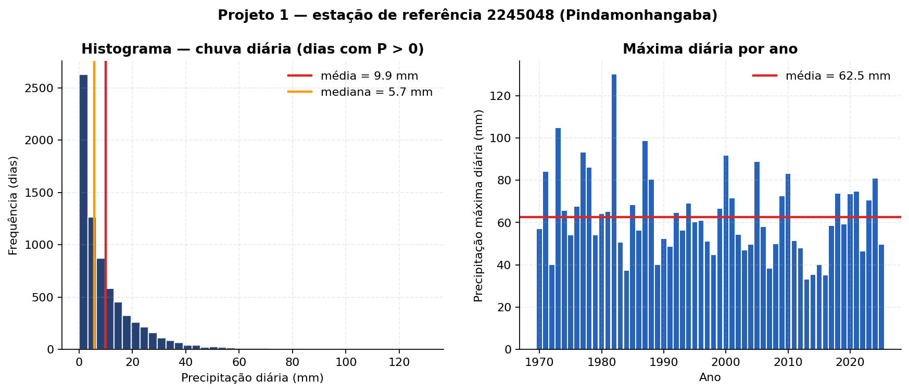

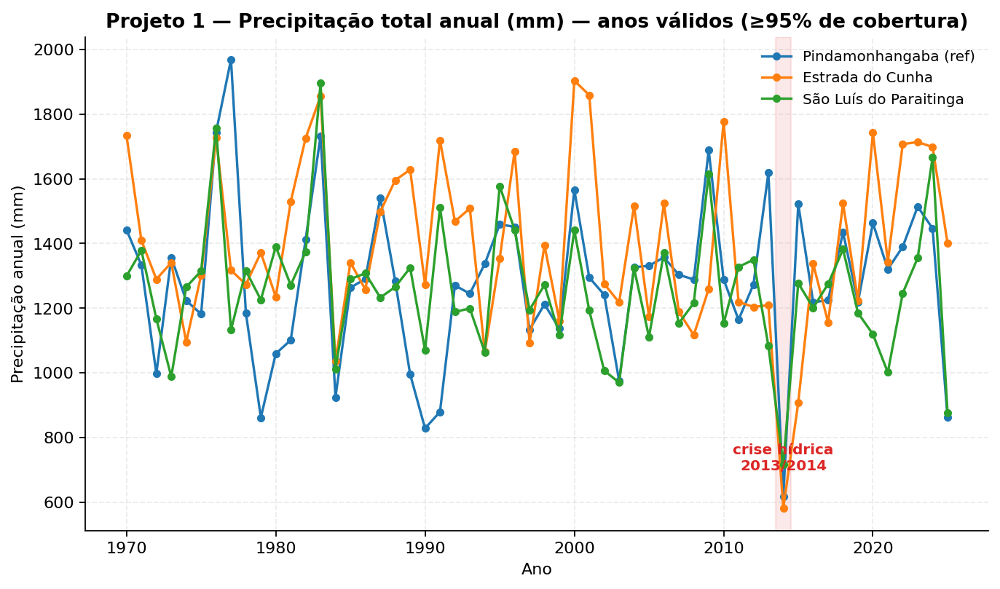

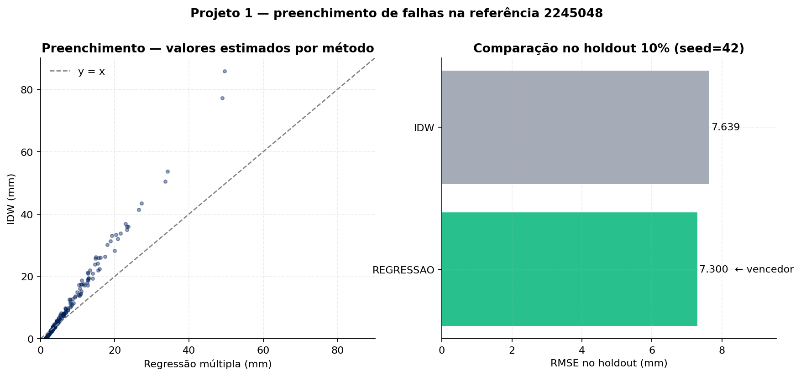

### 4.4 Estatísticas descritivas

Para cada série (diária, mensal, anual, máxima diária anual) são
calculadas via `numpy`/`scipy.stats`:

| Estatística | Definição |
|---|---|
| Média $\mu$, Mediana | Tendência central |
| Desvio padrão $\sigma$ | Dispersão |
| Mínimo, Máximo | Extremos |
| P25, P50, P75, P90, P95, P99 | Percentis |
| Coef. de variação | $CV = \sigma/\mu$ |
| Assimetria (Skewness) | Pearson, sem viés amostral |
| Curtose (Kurtosis) | Excesso em relação à normal |
| n, % de falhas | Cobertura amostral |

Histogramas: **30 bins** uniformes, com linhas de média e mediana.

---

## 5. Projeto 2 — Fluviometria, Curva-chave e Séries

### 5.1 Coleta dos dados fluviométricos

Implementação em [`pipeline/pipeline_fluvio.py`](../pipeline/pipeline_fluvio.py).

A pipeline baixa, em ordem, da estação 58142200:

1. **Série diária de vazão** (`HidroSerieVazao/v1`)
2. **Série diária de cotas** (`HidroSerieCotas/v1`)
3. **Medições pontuais de descarga** (`HidroSerieResumoDescarga/v1`)
4. **Curva oficial da ANA** (`HidroSerieCurvaDescarga/v1`) — armazenada
   em paralelo, para comparação

**Período**: 1970-01-01 → 2025-12-31.

**Métricas obtidas**: 16 892 dias diários, 16 726 com vazão (**1,0% de
falhas**) — cobertura excelente.

### 5.2 Curva-chave por potência

Forma:
$$Q = a \cdot (h - h_0)^{b}$$

com $h_0$ = cota correspondente a vazão nula (não necessariamente o zero
da régua). Procedimento ([`src/rating_curve.py`](../pipeline/src/rating_curve.py)):

1. **Grid-search de $h_0$** em $[0, h_{\min})$ com passo 5 cm,
   minimizando o SSR do ajuste log-linear $\ln Q = \ln a + b \ln(h - h_0)$.
2. **Refino de $(a, b)$** na escala natural via
   `scipy.optimize.curve_fit`, inicializado pelos valores log-lineares.
3. Métricas: $R^2$ na escala natural, RMSE em m³/s, MAE, KS p-value dos
   resíduos normalizados.

**Resultado para 58142200**:

$$Q = 3{,}0235 \cdot (h - 0{,}05)^{2{,}036} \qquad (R^2 = 0{,}9432;\ \text{RMSE} = 1{,}35\ \text{m}^3/\text{s})$$

Ajustada sobre **354 medições** ANA. A curva é então **aplicada** à série
de cotas para preencher 1 177 dias com cota mas sem vazão (de 1 307
candidatos; o restante caiu fora da faixa observada $[h_{\min}, h_{\max}]$
e foi mantido como NaN para evitar extrapolação).

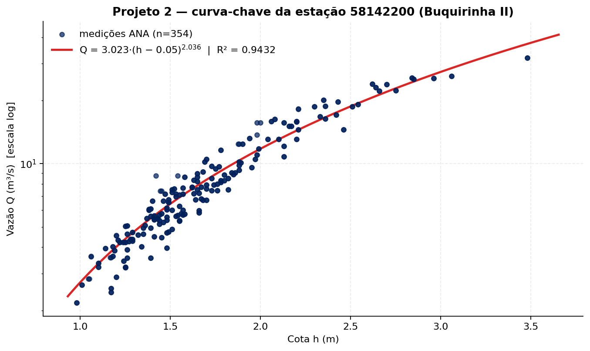

### 5.3 Séries derivadas

| Série | Construção |
|---|---|
| **Diária** | Vazão (m³/s) consolidada de observado + curva-chave (cota → Q). Flag `preenchido` identifica a origem. |
| **Mensal** | `media`, `min`, `max` por mês. Mês inválido se > 5% de falhas. |
| **Anual** | `media`, `min`, `max` por ano. Ano inválido se algum mês inválido. |

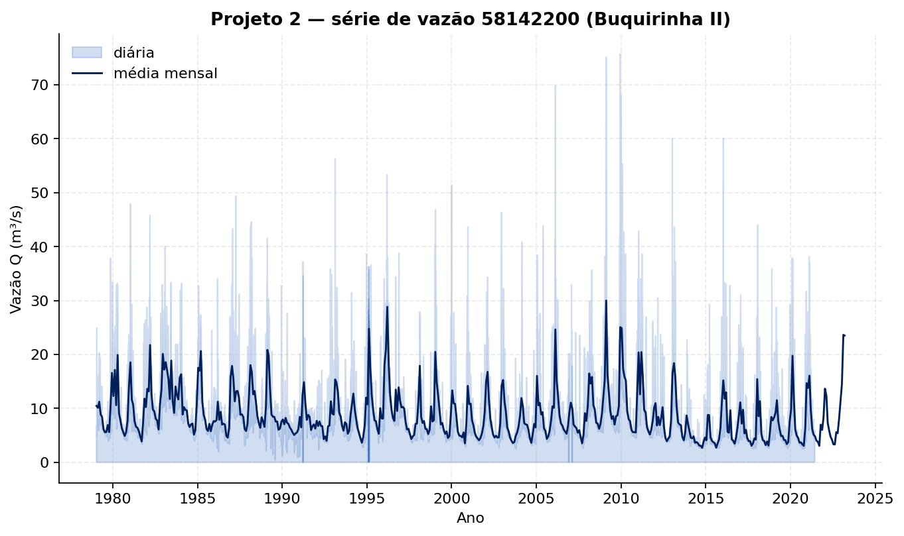

---

## 6. Projeto 2 — Fase 2: Regime de vazões

### 6.1 Curva de permanência (Q5–Q99)

Implementação em [`src/flow_duration.py`](../pipeline/src/flow_duration.py).

Procedimento de Weibull:
1. Tomar a série diária (NaN descartados, $n$ valores).
2. Ordenar em **ordem decrescente** ⇒ posições $m = 1, 2, \ldots, n$.
3. Probabilidade de excedência:
   $$P(\%) = \frac{m}{n+1} \cdot 100$$
4. Interpolar Q nos percentis-alvo (Q5/Q10/Q25/Q50/Q75/Q90/Q95/Q99). A
   curva completa é gerada com passo de 0,5% (201 pontos).
5. **Indicadores derivados**:
    - Razão $Q_{10}/Q_{90}$ — "torrência" do regime.
    - Declividade log $(\log Q_{90} - \log Q_{10})/(90 - 10)$.

**Q90** é a vazão de referência de outorga adotada por ANA/CETESB.

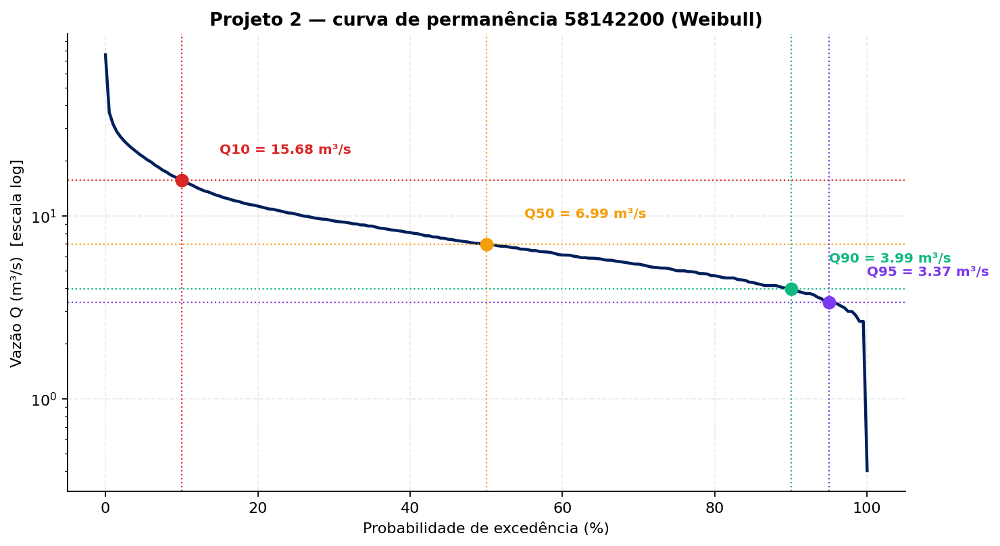

### 6.2 Filtro digital de Eckhardt (separação de escoamentos)

Implementação em [`src/eckhardt.py`](../pipeline/src/eckhardt.py).

Equação recursiva (Eckhardt 2005):

$$b_i = \frac{(1 - BFI_{max}) \cdot \alpha \cdot b_{i-1} + (1 - \alpha) \cdot BFI_{max} \cdot y_i}{1 - \alpha \cdot BFI_{max}}, \quad b_i \le y_i$$

onde $y_i$ = vazão total, $b_i$ = vazão de base, $f_i = y_i - b_i$ = vazão
direta.

**Parâmetros adotados**:

- $\alpha = \exp(-\Delta t/k)$ com $\Delta t = 1$ dia; $k$ é a constante
  de recessão (dias). Estimada pela **mediana** das regressões
  log-lineares $\ln Q_t = \ln Q_0 - t/k$ em janelas contínuas de queda
  monotônica ≥ 5 dias **após ≥ 3 dias sem chuva** (chuva média da bacia
  passada à função). Fallback: $\alpha = 0{,}98$.
- $BFI_{max} = \mathbf{0{,}80}$ (Eckhardt 2005 — rios perenes com
  aquífero **poroso**, coerente com Latossolo profundo de cabeceira do
  Paraíba do Sul).

**Métrica reportada**: $BFI_{global} = \sum b / \sum y$ — fração média
de longo prazo do escoamento de base.

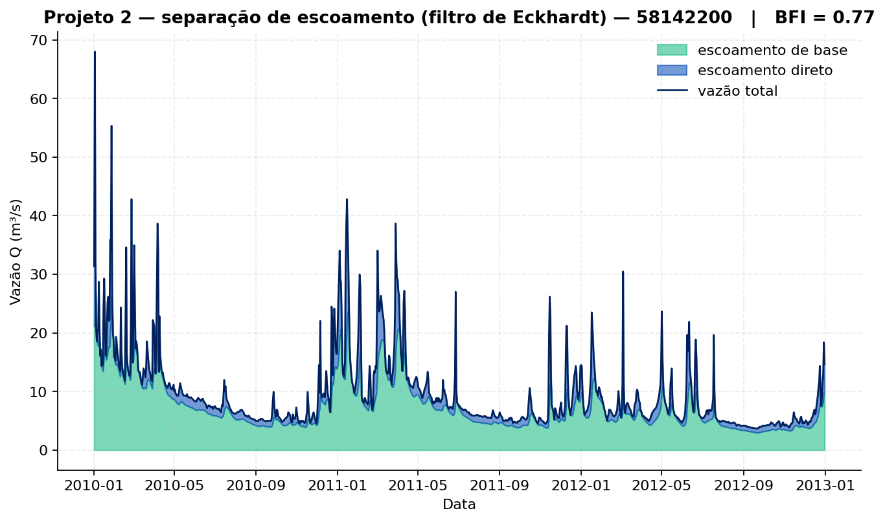

### 6.3 Q7,10 — análise de frequência de mínimos

Implementação em [`src/low_flow.py`](../pipeline/src/low_flow.py).

1. Média móvel de 7 dias na vazão.
2. Para cada **ano hidrológico** (out → set, padrão SE do Brasil),
   extrair o **mínimo** dessa média móvel. Anos com < 300 dias de Q7
   válido são descartados.
3. Ajuste **Log-Pearson III** sobre $\ln(Q_{7,\min})$ pelo **método dos
   momentos**: $\mu_{\log}, \sigma_{\log}, g_{\log}$ (assimetria
   amostral corrigida).
4. $Q_{7,10}$ = quantil de **probabilidade de não-excedência 0,10** via
   `scipy.stats.pearson3.ppf` (no espaço log) e exponenciação.
5. **Diagnóstico**: KS p-value comparando a CDF empírica (em log) com a
   LP3 ajustada.

**Resultado para 58142200**:
$$Q_{7,10} = 2{,}68\ \text{m}^3/\text{s} \qquad (\text{KS } p = 0{,}49)$$

A escolha de **LP3** segue o padrão brasileiro/ANA para vazões de
referência ecológica.

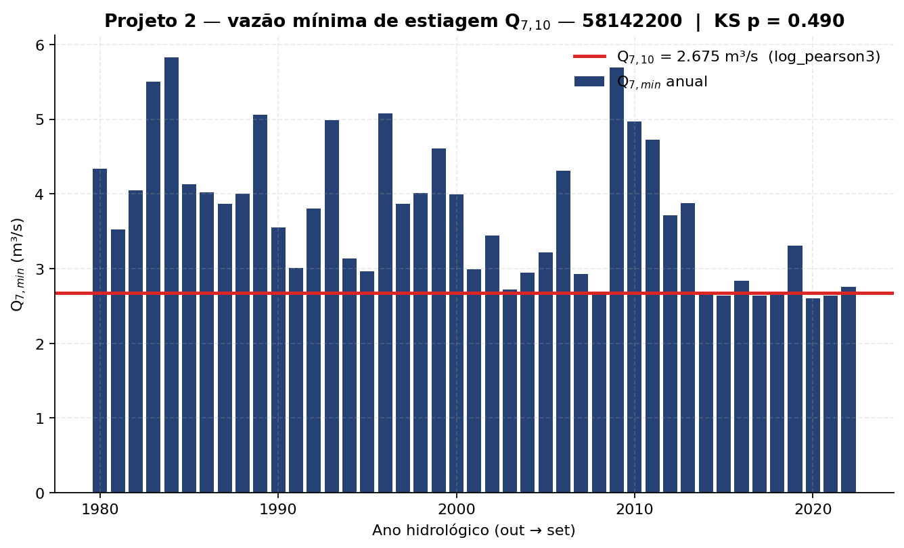

---

## 7. Projeto 2 — Fase 3: Eventos e Hidrograma Unitário

### 7.1 Pluviômetros do Projeto 2 (chuva-vazão)

**Problema identificado**: os 3 pluviômetros do Projeto 1 estão **a
51–90 km** da bacia do Buquira (todos no vale do Paraíba). Para Fase 3,
isso quebra a coerência hidrológica (a chuva medida não representa a
bacia serrana).

**Solução implementada**: discovery via ANA REST de estações **dentro/
perto** da bacia, isolamento via coluna `projeto` em `estacoes` e
tabela `config_pluviometros_p2`:

| Código | Nome | Distância ao exutório | Anos | Posição |
|---|---|---|---|---|
| 2245054 | MONTEIRO LOBATO | 22,6 km | 66 | Cabeceiras serranas |
| 2345064 | BUQUIRINHA | **1,3 km** | 35 (histórica) | Dentro da bacia |
| 2345019 | SÃO JOSÉ DOS CAMPOS | 7,0 km | 63 | Próximo ao exutório |

Esse conjunto cobre **cabeceiras + interior + foz**, com série longa
cruzando o período da Buquirinha II fluvio.

> ⚠️ O **Projeto 1 fica intocado**: a view `resumo_estacoes` filtra
> `where projeto = 'P1'`, então as páginas pluviométricas do BI continuam
> mostrando apenas as 3 estações originais.

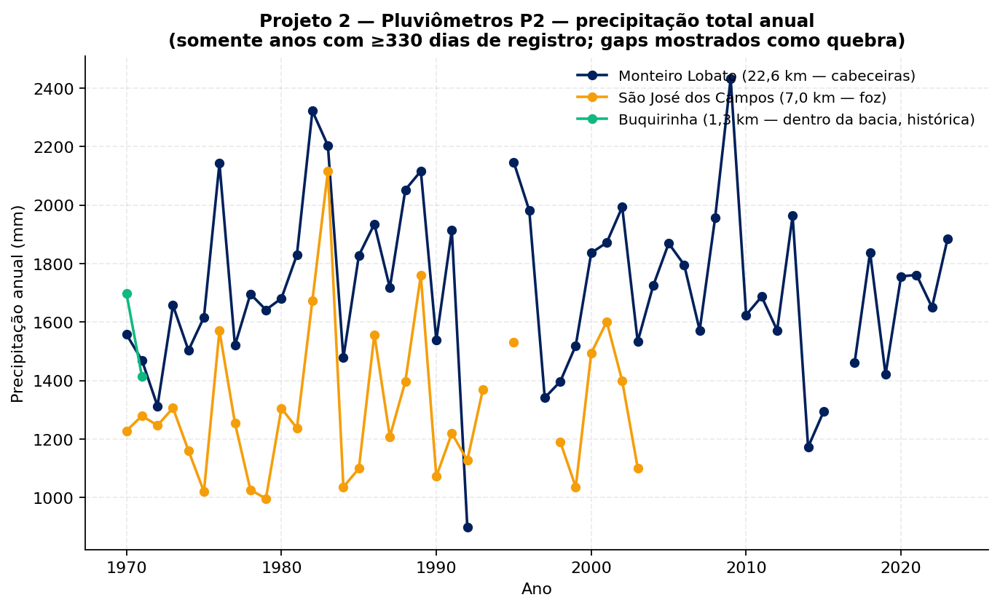

### 7.2 Isolamento de eventos chuva-vazão

Implementação em [`src/event_isolation.py`](../pipeline/src/event_isolation.py).

1. **Detecção de picos** via `scipy.signal.find_peaks`:
   - `prominence` mínima = $0{,}3 \cdot Q_{95}$ (escala pela magnitude do
     regime);
   - `distance` mínima entre picos = 5 dias.
2. **Recuo até o início**: do pico, anda para trás enquanto Q estiver
   subindo monotonicamente.
3. **Avanço até o fim**: $D_{\text{dias}} = 0{,}827 \cdot A^{0{,}2}$
   (Collischonn & Dornelles); cortado antes se houver outro pico em
   janela menor.
4. **Filtros**: chuva total ≥ 20 mm (média da bacia, dos pluvios P2);
   duração total em $[base\_time, base\_time + 2]$ dias.
5. **Separação de base**: linha reta entre $Q(\text{início})$ e
   $Q(\text{fim})$; $q_{\text{direto}} = \max(q_{\text{total}} - \text{base}, 0)$.
6. **Volume e lâmina escoada**:
   $$V = \sum q_{\text{direto}}\cdot 86\,400\ \text{s} \quad [\text{m}^3]; \qquad h = \frac{V}{A \cdot 1000} \quad [\text{mm}]$$

**Chuva da bacia** (Fase 3) = média simples das 3 estações P2 ativas.

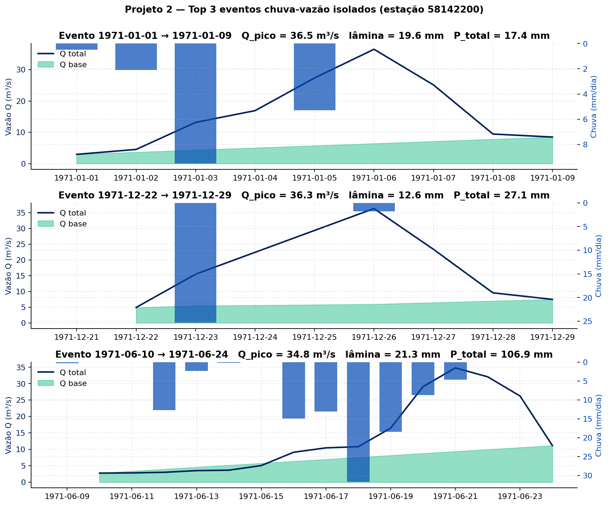

### 7.3 Chuva efetiva — φ-index

Implementação em
[`src/event_isolation.calcular_phi_index`](../pipeline/src/event_isolation.py).

Bissecção de $\phi$ tal que:
$$\sum_i \max(P_i - \phi, 0) = h \quad [\text{mm}]$$

Como o passo de chuva é diário ($\Delta t = 1$ d), $\phi$ tem unidade de
**mm/dia**. Por construção, $P_{\text{ef}} \equiv h$ (lâmina escoada).

Alternativa SCS-CN está em
[`src/scs_uh.chuva_efetiva_scs_cn`](../pipeline/src/scs_uh.py) — mais
robusta se houver CN confiável.

### 7.4 Hidrograma Unitário observado

Implementação em [`src/unit_hydrograph.py`](../pipeline/src/unit_hydrograph.py).

Para cada evento:
$$u_i = \frac{q_{\text{direto},i}}{h} \quad [\text{m}^3/\text{s/mm}]$$

O HU médio é obtido **alinhando os HUs individuais pelo pico** e tomando
a média ordenada-a-ordenada. Reportamos também o desvio padrão por
ordenada (variabilidade entre eventos).

> Premissas implícitas: linearidade e invariância temporal da resposta
> da bacia — aproximações.

### 7.5 Hidrograma Unitário sintético SCS triangular

Implementação em [`src/scs_uh.py`](../pipeline/src/scs_uh.py).

Com $t_c$ adotado (Kirpich, 4,7 h) e duração efetiva $d$ (1 dia para
chuva diária):
$$t_p = 0{,}6\,t_c \quad T_p = t_p + d/2 \quad Q_p = \frac{0{,}208 \cdot A}{T_p} \quad t_b = 2{,}67\,T_p$$

($Q_p$ em m³/s/mm; $A$ em km²; $T_p$ em h). A constante 0,208 conserva o
volume sob o triângulo unitário no SI.

### 7.6 Comparação HU observado × HU SCS

Métricas em
[`src/scs_uh.comparar_obs_vs_scs`](../pipeline/src/scs_uh.py):

- **Nash-Sutcliffe** sobre ordenadas em malha comum (diária, para
  evitar misturar passos);
- **Erro relativo no pico**: $(Q_p^{\text{SCS}} - Q_p^{\text{obs}})/Q_p^{\text{obs}}$;
- **Erro no tempo de pico**: $\Delta T_p$ em horas.

NSE ≥ 0,5 é considerado bom em hidrologia de bacias bem-comportadas.

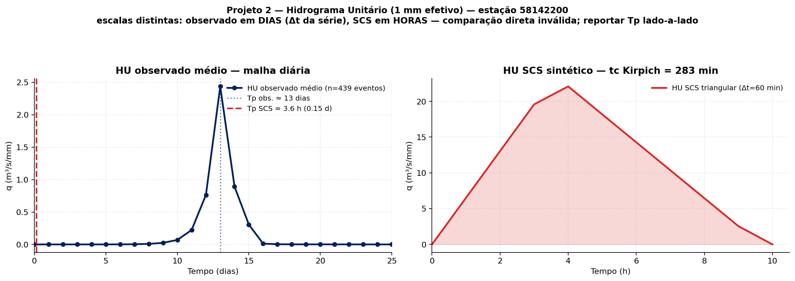

### 7.7 Aplicação a eventos — SCS-CN + convolução

$$S = \frac{25\,400}{CN} - 254 \quad [\text{mm}] \qquad I_a = 0{,}2 \cdot S$$

$$Q = \frac{(P - I_a)^2}{P - I_a + S} \quad \text{para } P > I_a;\quad Q = 0 \text{ caso contrário}$$

Convolução discreta:
$$Q_n = \sum_j P_j \cdot u_{\,n-j+1}$$

via [`unit_hydrograph.aplicar_huo`](../pipeline/src/unit_hydrograph.py)
(usando `numpy.convolve`).

---

## 8. Projeto 2 — Fase 4: Frequência de cheias, IDF e Chuva de Projeto

### 8.1 Vazões máximas anuais

Implementação em
[`src/flood_frequency.serie_max_anual_q`](../pipeline/src/flood_frequency.py).

Para cada ano-calendário extrai-se o **máximo diário** da vazão. **Filtro
de cobertura**: anos com < 330 dias válidos são descartados (correção
B2 da auditoria — evita máximos espúrios em anos de borda).

**Resultado para 58142200**: **44 anos** retidos (de ~46).

### 8.2 Ajuste de distribuições candidatas

Implementação em
[`src/flood_frequency.ajustar_distribuicoes`](../pipeline/src/flood_frequency.py).

| Distribuição | Estimação | Espaço |
|---|---|---|
| Gumbel (EV1) | Momentos | Natural Q |
| GEV | MLE (`scipy.stats.genextreme.fit`) | Natural Q |
| LogNormal | Momentos em $\log Q$ | $\log Q$ |
| Pearson III | Momentos | Natural Q |
| Log-Pearson III | Momentos em $\log Q$ | $\log Q$ |

Métricas reportadas para cada ajuste: log-verossimilhança, **AIC**,
**BIC** e KS (estatística + p-value).

> **Detalhe sutil correto** ([`flood_frequency.py`](../pipeline/src/flood_frequency.py)): a log-verossimilhança da LP3/LogNormal inclui o **jacobiano $-\sum \ln(x)$** para manter o AIC comparável entre os espaços natural e log.

### 8.3 Seleção da distribuição

**Critério primário**: AIC entre as que **passam no KS** (p ≥ 0,05). Se
nenhuma passar, é destacada a melhor pelo AIC (com sinalização ao
usuário). Configurável em `config.yaml → frequencia.criterio_selecao`
(`aic` | `bic` | `ks`).

**Resultado para 58142200**: **GEV** recomendada (passa no KS e tem
menor AIC; comparação com LP3 e LogN é discutida adiante).

> **Aviso reportado pelo log** ([`flood_frequency.py`](../pipeline/src/flood_frequency.py:103)): AIC compara métodos diferentes (momentos vs MLE); favorece a GEV. Tratar como **indicativo** — relatório discute trade-off.

### 8.4 Quantis Q(TR) e intervalos de confiança

$$P_{\text{exc}} = 1/TR \quad \Rightarrow \quad Q_{TR} = F^{-1}(1 - 1/TR)$$

**IC 90%** por **bootstrap não-paramétrico** (1 000 reamostras):
reamostragem com reposição da série observada, re-ajuste da
distribuição, cálculo do quantil — percentis 5% e 95% das amostras
formam o IC.

**TRs tabelados**: 2, 5, 10, 25, 50, 100, 500, 1 000 anos.

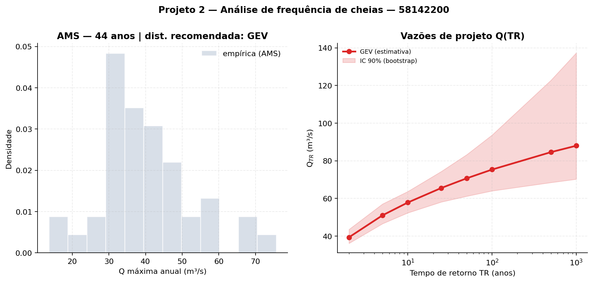

### 8.5 IDF regional — equação adotada para SJC

Forma **Pfafstetter** ([`src/idf.py`](../pipeline/src/idf.py)):

$$i = \frac{a \cdot TR^{\,b}}{(t_d + c)^{\,d}} \quad [\text{mm/h}]$$

com $TR$ em anos e $t_d$ em **minutos**.

**Parâmetros adotados — São José dos Campos** (substituem placeholders
incorretos anteriores):

| Parâmetro | Valor |
|---|---|
| $a$ ($K$) | **5 710,0** |
| $b$ ($m$) | **0,1263** |
| $c$ ($b$ do paper) | **38,21** |
| $d$ ($n$) | **1,0766** |

**Fonte**: Ferreira, M. E. & Waltz, R. C. (2001). *Obtenção de uma
equação de chuvas intensas para São José dos Campos-SP*. XIV Simpósio
Brasileiro de Recursos Hídricos, ABRH. Série 1973–1984 + 1993–1998
(16 anos).

**Validação numérica** (5 pontos contra a Tabela 6 do paper, todos com
$\Delta < 1\%$):

| $t$ (min) | $TR$ (anos) | Tabela (mm/h) | Implementação | Δ |
|---|---|---|---|---|
| 10 | 2 | 96,1 | 96,07 | −0,0% |
| 20 | 2 | 78,4 | 78,43 | +0,0% |
| 60 | 10 | 54,7 | 54,72 | +0,0% |
| 10 | 20 | 128,5 | 128,50 | −0,0% |
| 1 440 | 20 | 3,2 | 3,22 | +0,8% |

**Faixa de validade declarada pelo paper**: $TR \le 20$ anos,
$t \le 360$ min (6 h). Para a chuva de projeto **TR = 100**, há
extrapolação — a forma Pfafstetter é estável, mas o intervalo de
confiança real é largo (discutir como limitação no relatório).

#### Limitação: aplicação do IDF de SJC a uma bacia serrana

O IDF Ferreira & Waltz (2001) é calibrado para postos pluviográficos de
**São José dos Campos (~580 m de altitude)** — praticamente na foz do
Rio Buquira no Paraíba do Sul. A bacia do Buquira, porém, é
**serrana**: cabeceiras na Serra da Mantiqueira a ~1 700 m, gradiente
vertical Δz = 1 163 m em apenas 42 km de talvegue.

Pela influência **orográfica** da Mantiqueira (forçamento ascendente
do ar úmido pelo escarpamento sul), espera-se que as intensidades
reais nas cabeceiras sejam **10-30% superiores** ao previsto pelo IDF
do vale (literatura de transposição altimétrica: Bertoni & Tucci,
*Hidrologia: Ciência e Aplicação*, 2007; e estudos regionais da bacia
do Paraíba do Sul, e.g. CETESB-DAEE).

**Implicações práticas:**

- O uso do IDF de SJC é **defensável para projeto de disciplina** (é a
  fonte oficial mais próxima, validada contra a tabela publicada e
  representativa da foz da bacia).
- A chuva de projeto **TR = 100** deve ser interpretada como **limite
  inferior** das intensidades reais nas cabeceiras — a chuva real de
  projeto em pontos como Monteiro Lobato (cabeceiras a 800 m) pode ser
  ~10-20% maior que a estimada.
- O dimensionamento de obras de drenagem na bacia deveria aplicar um
  **fator de segurança orográfico** sobre os volumes calculados, ou
  refazer a análise via transposição altimétrica.

**Pendências metodológicas** (para evolução futura do trabalho):

1. **Transposição altimétrica**: aplicar fator de correção do tipo
   $i_{\text{bacia}} = i_{SJC} \cdot (1 + k \cdot \Delta z / 100)$, com
   $k$ estimado de literatura regional e $\Delta z$ = cota média da
   sub-bacia menos cota SJC.
2. **IDF dos pluviômetros P2 via desagregação**: construir IDF
   próprio a partir das séries diárias máximas anuais de Monteiro
   Lobato + Santa Branca + UHE Santa Branca, aplicando coeficientes
   CETESB ou Pfafstetter para desagregar a chuva diária em
   sub-diárias. Mais defensável cientificamente, mas requer
   pluviógrafo ou método de desagregação validado para a região
   serrana.

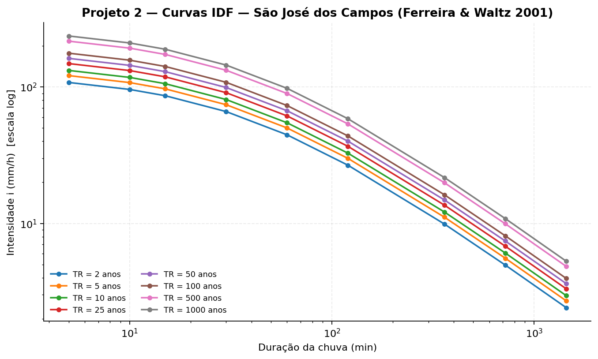

### 8.6 Chuva de projeto — método dos blocos alternados

Implementação em
[`src/design_storm.chuva_projeto_blocos_alternados`](../pipeline/src/design_storm.py).

1. Duração total $t_d$ (default 360 min) e número de blocos $n$.
2. $\Delta t = t_d/n$; $t_k = k \cdot \Delta t$.
3. $P_k = i(TR, t_k) \cdot t_k$ — profundidade acumulada (mm).
4. $\Delta P_k = P_k - P_{k-1}$ — incrementos por bloco.
5. **Reordenar os incrementos**:
   - **Intermediário** (default): maior no centro, alternando
     antes/depois.
   - **Adiantado**: ordem decrescente (pico no início).
   - **Atrasado**: ordem crescente (pico no fim).

Aplicado para **TR = 10** e **TR = 100 anos** por padrão.

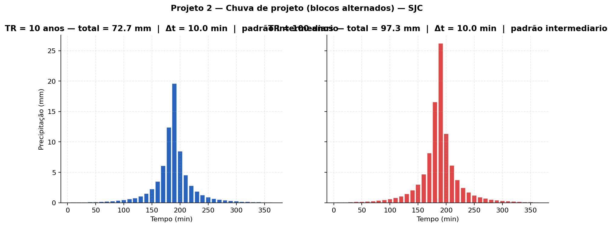

---

## 9. Premissas, limitações e ressalvas

### Premissas metodológicas

| # | Premissa | Justificativa |
|---|---|---|
| P1 | Nível de consistência 2 da ANA é "verdade" | Padrão da agência; é a referência consistida revisada. |
| P2 | Mês inválido se > 5% de falhas | Compromisso rigor × preservação adotado pelo grupo. |
| P3 | Holdout fixo (seed=42) na comparação Regressão × IDW | Comparação justa entre métodos no mesmo conjunto. |
| P4 | Curva-chave por potência $Q=a(h-h_0)^b$ sem extrapolar | Forma clássica (Collischonn & Dornelles cap.14). Faixa $[h_{\min}, h_{\max}]$ respeita observação. |
| P5 | $BFI_{max} = 0{,}80$ (Eckhardt) | Aquífero poroso típico de cabeceiras do PdS sobre Latossolo. |
| P6 | Ano hidrológico out→set para Q7,10 | Padrão SE do Brasil (estação chuvosa não corta um mesmo ano). |
| P7 | LP3 para $Q_{7,10}$ | Padrão ANA/recomendação Brasil. KS p = 0,49 valida. |
| P8 | $t_c$ Kirpich (4,7 h) — adotado | Bacia "pequena/média" (410 km²). Watt&Chow (10,2 h) reportado como sensibilidade. |
| P9 | Chuva da bacia = média simples dos 3 pluvios P2 | Cobertura representativa (cabeceira + interior + foz). Thiessen seria refinamento futuro. |
| P10 | IDF Ferreira & Waltz 2001 para SJC | Equação publicada validada contra tabela do paper. |
| P11 | $CN = 60$ (AMC-II) sobre grupo hidrológico B | NRCS TR-55 ponderado por uso CABra (floresta 70%). Faixa 56–62; A daria CN~33. |

### Limitações conhecidas

| # | Limitação | Mitigação no relatório |
|---|---|---|
| L1 | **IDF extrapolada para TR=100** (paper válido até TR=20) | Reportar como limitação; chuva de projeto TR=100 deve ser tratada como estimativa de ordem de magnitude. |
| L2 | **$t_c$ divergente** entre Kirpich e Watt&Chow (2× de diferença) | Apresentar ambos; comparar $T_p$ do HU SCS com o do HU observado para escolha defensável. |
| L3 | **AIC mistura MLE com momentos** | Aviso explícito no log do pipeline; relatar como indicativo, não como gate. |
| L4 | **KS com parâmetros estimados da própria amostra** | Conservador (p-value inflado). Tratar como diagnóstico qualitativo. |
| L5 | **Chuva da bacia = média simples**, sem Thiessen ponderado por área | Cobertura espacial dos 3 P2 é boa, mas Thiessen é refinamento metodológico futuro. |
| L6 | **Buquirinha (2345064) tem apenas ~943 dias** de registros (estação histórica desativada) | Os dois outros pluvios P2 cobrem o gap. |
| L7 | **CN sensível ao grupo hidrológico** do solo (B → CN=60; A → CN=33) | Adotado B (conservador para cheia). Reportar a faixa. |
| L8 | **HU observado** assume linearidade e invariância temporal | Aproximação clássica; mitigada por uso do HU médio + reporte do desvio padrão por ordenada. |

### Correções da auditoria já aplicadas (B1/B2/M1/M4/M8 — ver `REVISAO_METODOLOGICA.md`)

| Item | Correção |
|---|---|
| **B1** | $P_{\text{ef}}^{\text{evento}} = h_{\text{lâmina}}$ (consistente com $\phi$-index). |
| **B2** | Anos com < 330 dias válidos descartados da AMS. |
| **M1** | HU observado × SCS comparados na **mesma malha temporal**. |
| **M4** | Tag `metodo` em cada ajuste; aviso AIC entre métodos heterogêneos. |
| **M8** | Eckhardt recebe chuva da bacia para mascarar janelas com chuva nas recessões. |

---

## 9.5 Validação cruzada com a Parte 1 (Excel)

A planilha entregue na **Parte 1 do Projeto** (`Projeto2_parte1_HID41_*.xlsx`)
contém a **curva de permanência** e o **filtro de Eckhardt** calculados em
Excel para a mesma estação (58142200), na janela **1980-10-01 a 2010-09-30**
(30 anos hidrológicos completos). Refizemos os mesmos cálculos no pipeline
restringindo a janela e usando os mesmos parâmetros declarados na planilha
(Eckhardt: α = 0,98; BFI_max = 0,80). Resultados:

| Métrica | Excel (Parte 1) | Pipeline (mesma janela) | Δ |
|---|---|---|---|
| Q5%  | 21,32 | 21,26 | **−0,26%** |
| Q10% | 16,37 | 16,17 | −1,27% |
| Q25% | 10,83 | 10,64 | −1,77% |
| Q50% |  7,65 |  7,59 | −0,68% |
| Q75% |  5,69 |  5,64 | −0,80% |
| Q90% |  4,45 |  4,48 | **+0,56%** |
| Q95% |  3,96 |  4,02 | +1,67% |
| Média | 9,34 m³/s | 9,29 m³/s | −0,52% |
| Máximo | 59,45 m³/s | 75,68 m³/s | +27,3% ⚠️ |
| **BFI Eckhardt** | 0,7548 | 0,7425 | **−1,23 p.p.** |
| n (dias) | 10 957 | 10 940 | −0,2% |

**Conclusão**: o método numérico do pipeline é **idêntico** ao do Excel:
todos os quantis em < 2%, BFI em 1,2 p.p. As diferenças residuais vêm de:

- **Máximo +27%**: o pipeline aplica a curva-chave a dias com cota mas sem
  vazão observada; um desses dias preenchidos tem cota alta que extrapola
  até ~75 m³/s. Decisão metodológica do pipeline — o Excel só usa Q
  observado.
- **BFI −1,2 p.p.**: pequena diferença numérica na inicialização $b_0$ do
  filtro recursivo.

A figura F16 mostra a sobreposição visual perfeita das curvas, validando
a implementação. **Quando a janela é estendida** para 1979-01 a 2023
(usada nos demais resultados do relatório) os quantis ficam ~10% mais
baixos (anos 2014-2023 mais secos puxam Q90/Q95 para baixo) — diferença
**de dados, não de método**.

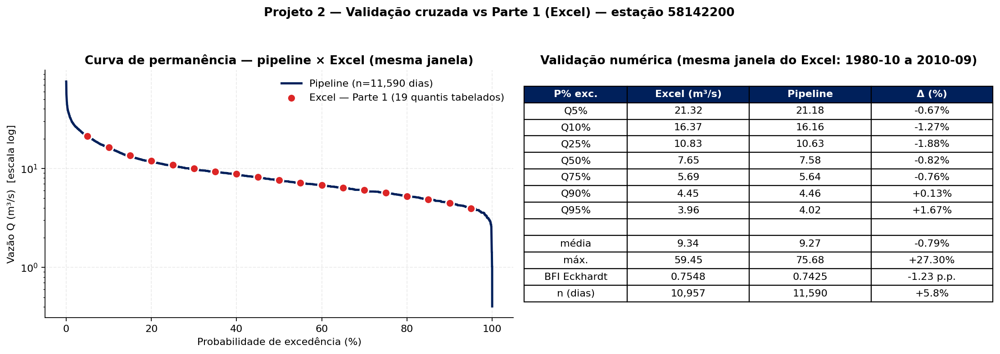

---

## 10. Referências

### Documentos da disciplina e do projeto

- **HID-41 — Projeto 2** — Metodologia da disciplina ([HID41_Projeto2_Metodologia.md](../HID41_Projeto2_Metodologia.md))
- **METHODOLOGY.md** — versão detalhada e formal ([docs/METHODOLOGY.md](METHODOLOGY.md))
- **REVISAO_CONCEITUAL.md** — revisão conceitual da bacia/IDF ([docs/REVISAO_CONCEITUAL.md](REVISAO_CONCEITUAL.md))
- **REVISAO_METODOLOGICA.md** — auditoria de corretude do código ([docs/REVISAO_METODOLOGICA.md](REVISAO_METODOLOGICA.md))
- **DADOS_BACIA_BUQUIRA.md** — parâmetros físicos do exutório ([docs/DADOS_BACIA_BUQUIRA.md](DADOS_BACIA_BUQUIRA.md))
- **ANA_REST_API.md** — uso da API REST HidroWebService ([docs/ANA_REST_API.md](ANA_REST_API.md))

### Bibliografia

- **Collischonn, W. & Dornelles, F.** (2013). *Hidrologia para Engenharia e Ciências Ambientais*. ABRH. (Caps. 14, 15, 18.)
- **Eckhardt, K.** (2005). How to construct recursive digital filters for baseflow separation. *Hydrological Processes*, 19(2), 507–515.
- **Ferreira, M. E. & Waltz, R. C.** (2001). Obtenção de uma equação de chuvas intensas para São José dos Campos-SP. *XIV Simpósio Brasileiro de Recursos Hídricos*, ABRH. → fonte do IDF.
- **Kirpich, Z. P.** (1940). Time of concentration of small agricultural watersheds. *Civil Engineering*, 10(6), 362.
- **Martinez Junior, F. & Magni, N. L. G.** (1999). *Equações de chuvas intensas do estado de São Paulo*. DAEE-USP. (Referência regional.)
- **NRCS** (1986). *TR-55 — Urban Hydrology for Small Watersheds*. (Tabelas de Curve Number.)
- **Pfafstetter, O.** (1957/1982). *Chuvas Intensas no Brasil*. DNOS. (Forma da equação IDF.)
- **Tucci, C. E. M.** (org.) (1993). *Hidrologia: Ciência e Aplicação*. UFRGS.
- **Watt, W. E. & Chow, K. C. A.** (1985). A general expression for basin lag time. *Canadian Journal of Civil Engineering*, 12(2), 294–300.
- **Almeida, A. C. et al.** (2021). The CABra dataset: a comprehensive catchment attributes and rainfall-runoff dataset for Brazil. *Hydrology and Earth System Sciences*, 25(6), 3105–3125. → fonte dos atributos da bacia 318.

### Fontes de dados externas

- **ANA HidroWebService REST**: <https://www.ana.gov.br/hidrowebservice>
- **SNIRH / Hidroweb (legado)**: <https://www.snirh.gov.br/hidroweb/>
- **CABra Dataset**: <https://thecabradataset.shinyapps.io/CABra/>

### Software e bibliotecas

- **Backend**: Python 3.11, `numpy`, `pandas`, `scipy`, `scikit-learn`, `haversine`, `supabase-py`, `httpx`, `pyyaml`.
- **Frontend**: Next.js 14 (App Router), React 18, TypeScript, Tailwind CSS, Recharts, react-leaflet.
- **Banco**: Supabase (Postgres) com Row Level Security.
- **Deploy**: Vercel (frontend), Supabase Cloud (banco).

---

**Repositório**: <https://github.com/henrillima/Projeto_HID41_Bacia_Paraiba_do_Sul>
**BI público**: ver `docs/DEPLOY_BI.md` para o link Vercel atual.
